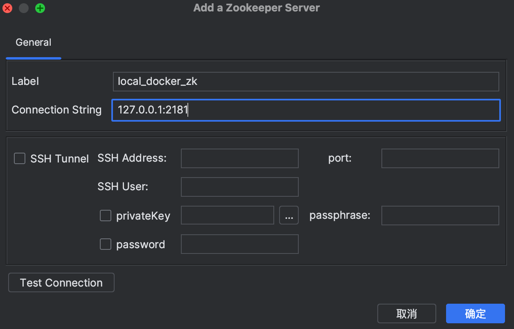
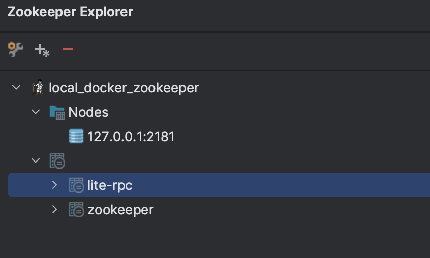

# Zookeeper安装和Java客户端调试

## Docker 安装Zookeeper

必须条件，Mac系统本地安装完毕docker，可以docker search查看一下版本，但是本文档不安装latest版本的Zookeeper

```bash
docker pull zookeeper:3.8.1
```

**上面就安装好了zk镜像在本地docker上，在正式运行容器之前，先配置一下挂载的一些文件。**

打开一个terminal，执行下面命令，最终目标是：创建zoo.cfg在~/my_zk/下的conf文件。

```bash
cd ~

mkdir my_zk

cd my_zk

mkdir data conf logs

touch zoo.cfg
```

打开zoo.cfg，输入并保存下面内容

```
# 配置内容如下
dataDir=/data
clientPort=2181
dataLogDir=/datalog
# 心跳时间 一次tic-toc 为2s
tickTime=2000
initLimit=5
syncLimit=2
autopurge.snapRetainCount=3
autopurge.purgeInterval=0
maxClientCnxns=60
standaloneEnabled=true
admin.enableServer=true
server.1=localhost:2888:3888;2181
```

**回到docker操作，运行容器并起名为zk-simple(随意命名)**

```bash
docker run -d \
--name zk-simple \
--privileged=true \
-p 2181:2181 \
-v /Users/yelihu/my_zk/data:/data \
-v /Users/yelihu/my_zk/conf:/conf \
-v /Users/yelihu/my_zk/logs:/datalog \
zookeeper:3.8.1
```

运行完毕，打开一个docker终端

```bash
docker exec -it zk-simple /bin/bash
```

可以看到如下输出：

```
ZooKeeper JMX enabled by default
Using config: /conf/zoo.cfg
Client port found: 2181. Client address: localhost. Client SSL: false.
Mode: standalone
```

使用zkCli.sh启动容器，输入如下命令可以借助zk提供的客户端，操作zk：

```bash
docker exec -it zk-simple zkCli.sh
```

这里其实就已经完成了，除了可以看到输出的一些Debug级别的心跳日志以外，还可以在下面输入命令，比如：

```bash
ls /
create /test_create
create /test_create/first
ls /test_create/first
```

到此为止，结束docker上Zookeeper的安装，更多操作在Java客户端进行操作

## Zookeeper Java客户端运行

### （可选）安装一个IDEA插件

可以可视化Zookeeper的节点情况和在上面进行节点操作，IDEA的插件市场搜索Zookeeper，可以看到Zookeeper-Admin，虽然是付费插件，但是很便宜。也可以选择免费的插件（
*大同小异*），安装完毕之后如下配置上一届安装和运行好的

Zookeeper👇🏻



点击确定，看到如下内容，（lite-rpc是我自己创建的node）



###  

### Maven引入Zookeeper客户端

创建maven项目并引入其他junit之类的依赖，然后引入Zookeeper的依赖，注意这里的版本和本机安装的Zookeeper对应👇🏻：

```xml
<properties>
  	<!-- 其他依赖忽略 -->
    <zookeeper.version>3.8.1</zookeeper.version>
</properties>
<dependency>
    <groupId>org.apache.zookeeper</groupId>
    <artifactId>zookeeper</artifactId>
    <version>${zookeeper.version}</version>
</dependency>
```

**写一个单测，测试节点的创建**

```java
public class ZooKeeperTest {
    private static final String CONNECT_STRING = "127.0.0.1:2181";
    private static final int SESSION_TIMEOUT_MILL_SEC = 3000;
    private static final byte[] DATA_BYTES = "hello".getBytes();

    ZooKeeper zooKeeper;

    {
        try {
            zooKeeper = new ZooKeeper(CONNECT_STRING, SESSION_TIMEOUT_MILL_SEC, null);
        } catch (IOException e) {
            throw new RuntimeException(e);
        }
    }

    @Test
    public void testNode() {
        //权限：完全开放，任何client都可以操作节点
        List<ACL> openAclUnsafe = ZooDefs.Ids.OPEN_ACL_UNSAFE;
        //创建节点, 选择类型PERSISTENT或者EPHEMERAL，
        // 1. PERSISTENT在客户端下线的时候不会被删除
        String result = null;
        try {
            result = zooKeeper.create("/lite-rpc", DATA_BYTES, openAclUnsafe, CreateMode.PERSISTENT);
            System.out.println(result);
        } catch (KeeperException | InterruptedException e) {
            throw new RuntimeException(e);
        }

    }
}
```

## Zookeeper 集群安装

参考👇🏻:
[6_使用Docker在Mac上搭建Zookeeper集群.md](6_%E4%BD%BF%E7%94%A8Docker%E5%9C%A8Mac%E4%B8%8A%E6%90%AD%E5%BB%BAZookeeper%E9%9B%86%E7%BE%A4.md)
