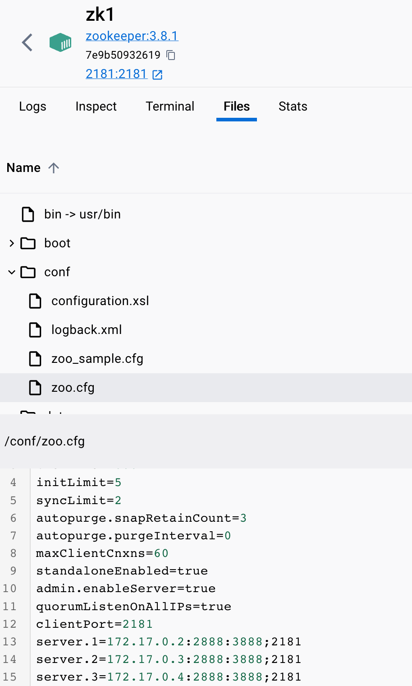
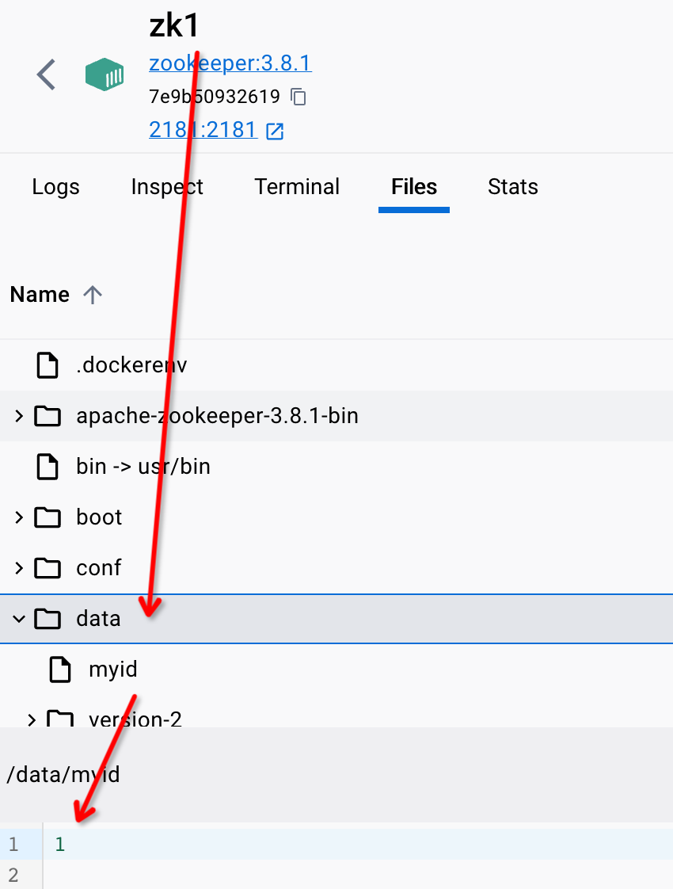

# 使用Docker在Mac上搭建Zookeeper集群

## 先run起来

之前已经将zookeeper:3.8.1的镜像拉取下来了，现在可以直接先run起来三个container。分别命名zk1、2、3。

```shell
docker run -d --name zk1 -p 2181:2181 -d zookeeper:3.8.1
docker run -d --name zk2 -p 2182:2181 -d zookeeper:3.8.1
docker run -d --name zk3 -p 2183:2181 -d zookeeper:3.8.1
```

docker ps展示正在启动的container，**记住CONTAINER ID ，下面会用**

```
CONTAINER ID   IMAGE             COMMAND                   CREATED         STATUS         PORTS                                                  NAMES
b3bcc42bbb1c   zookeeper:3.8.1   "/docker-entrypoint.…"   5 seconds ago   Up 4 seconds   2888/tcp, 3888/tcp, 8080/tcp, 0.0.0.0:2183->2181/tcp   zk3
d66283656ef5   zookeeper:3.8.1   "/docker-entrypoint.…"   5 seconds ago   Up 4 seconds   2888/tcp, 3888/tcp, 8080/tcp, 0.0.0.0:2182->2181/tcp   zk2
7e9b50932619   zookeeper:3.8.1   "/docker-entrypoint.…"   5 seconds ago   Up 4 seconds   2888/tcp, 3888/tcp, 0.0.0.0:2181->2181/tcp, 8080/tcp   zk1

```

逐个执行下面命令，注意每一行container id对应的容器name是什么：

```
docker inspect b3bcc42bbb1c | grep "IPAddress"
..."IPAddress": "172.17.0.4",...
docker inspect d66283656ef5 | grep "IPAddress"
..."IPAddress": "172.17.0.3",...
docker inspect 7e9b50932619 | grep "IPAddress"
...IPAddress": "172.17.0.2...
```

按照顺序得到如下表格，

| CLUSTER NAME | CONTAINER ID | IP         |
|--------------|--------------|------------|
| zk1          | 7e9b50932619 | 172.17.0.2 |
| zk2          | d66283656ef5 | 172.17.0.3 |
| zk3          | b3bcc42bbb1c | 172.17.0.4 |

## 修改配置文件

需要**逐个**进入容器对容器内部的配置文件进行修改，我们先对zk1这个container进行配置文件修改，总共需要做两件事：

1. 修改/conf/zoo.cfg，给集群当中的各个节点配置IP信息方便集群之间消息传递
2. 新增myid，表示本容器是哪个节点。

> 逐个对zk1、2、3循环下面两个小节的操作，”修改配置文件“阶段才算完成~

### 修改zoo.cfg

```shell
docker exec -it zk1 /bin/bash
```

需要一个文本编辑器，如果不是docker dashboard的话需要安装一个vim

```shell
apt-get update
apt-get install vim
```

当然如果有docker dashboard直接点击"Files" Tab直接修改即可, *注意保存~*




修改配置文件内容如下，这里如果随便复制网上的配置可能会出错，下面这个配置在3.8.1的zookeeper版本是work的，”####“的内容是我基于原有的zoo.cfg进行补充的部分

```properties
dataDir=/data
dataLogDir=/datalog
tickTime=2000
initLimit=5
syncLimit=2
autopurge.snapRetainCount=3
autopurge.purgeInterval=0
maxClientCnxns=60
standaloneEnabled=true
admin.enableServer=true
#### 
quorumListenOnAllIPs=true
clientPort=2181
server.1=172.17.0.2:2888:3888;2181
server.2=172.17.0.3:2888:3888;2181
server.3=172.17.0.4:2888:3888;2181
```

需要注意的几个点：

1. clientPort=2181这个必须指定
2. server.1=172.17.0.2:2888:3888;2181 后面必须要加上”;2181“和上面clientPort对应，否则启动报错
3. 注意保存对这个文件的修改

### 新增myid

比如当前是在zk1容器内，对应的是server.**<u>1</u>**，那么就输入命令：

```
echo 1 > /data/myid
```

上面命令的作用就是表示当前这个zookeeper实例是1节点，在配置文件里面对应的是

```properties
server.1=172.17.0.2:2888:3888;2181
```



其他配置文件照猫画虎，根据容器和实例修改echo 后面的数字即可。

## 重启容器

```shell
docker restart zk1
docker restart zk2
docker restart zk3
```

## 验证实例状态

以验证zk这个容器内的zookeeper实例1为例：

```bash
docker exec -it zk1 /bin/bash
```

执行命令：

```bash
./bin/zkServer.sh status        
```

得到下面结果，关键是 **Mode: follower**，表明这是一个follower节点：

```
ZooKeeper JMX enabled by default
Using config: /conf/zoo.cfg
Client port found: 2181. Client address: localhost. Client SSL: false.
Mode: follower
```

换到zk2节点，尝试一下可以发现：

```
ZooKeeper JMX enabled by default
Using config: /conf/zoo.cfg
Client port found: 2181. Client address: localhost. Client SSL: false.
Mode: leader
```

这是一个leader节点

## 测试和验证

```java
private static final String CONNECT_CLUSTER_STRING="127.0.0.1:2181,127.0.0.1:2182,127.0.0.1:2183";
private static final int SESSION_TIMEOUT_MILL_SEC=3000;
private static final byte[]DATA_BYTES="hello".getBytes();

@Test
public void testNode(){
        String result=null;
        try(ZooKeeper zooKeeper=new ZooKeeper(CONNECT_CLUSTER_STRING,SESSION_TIMEOUT_MILL_SEC,null)){
        result=zooKeeper.create("/lite-rpc",DATA_BYTES,ZooDefs.Ids.OPEN_ACL_UNSAFE,CreateMode.PERSISTENT);

        System.out.println(result);
        }catch(InterruptedException|IOException|KeeperException e){
        throw new RuntimeException(e);
        }
        }
```

编写测试代码如上，单测通过并输出了result。

随意挑选一个实例，比如zk1、zk2，执行如下命令和ls /，均能看到刚刚创建的持久节点/lite-rpc

```
docker exec -it zk2 zkCli.sh

ls /
```

**至此，使用Docker在Mac上搭建Zookeeper集群任务结束！**

## 总结

1. 集群部署注意修改配置，IP地址和配置文件中的节点IP地址关系密切；myid和server.?当中?的数字关系密切，并且要标注clientPort（注意新老版本zookeeper的写法差异）。
2. ./bin/zkServer.sh status 命令会说明当前节点是leader还是follower。
3. ZooKeeper的Java API在连接集群的时候，集群IP使用”,”分割的，不要写成”;“。

## 参考资料

1. [Zookeeper：Mac通过Docker安装Zookeeper集群](https://www.xjx100.cn/news/20558.html?action=onClick)
2. [Exception while listening... 报错解决](https://blog.csdn.net/u012580143/article/details/84136871)
3. [Client port not found in static config file. Looking in dynamic config 报错解决](https://blog.csdn.net/Java_HuiLong/article/details/110383191)
4. [clientPort和";x"指定客户端port的问题](https://zhuanlan.zhihu.com/p/570110759)


