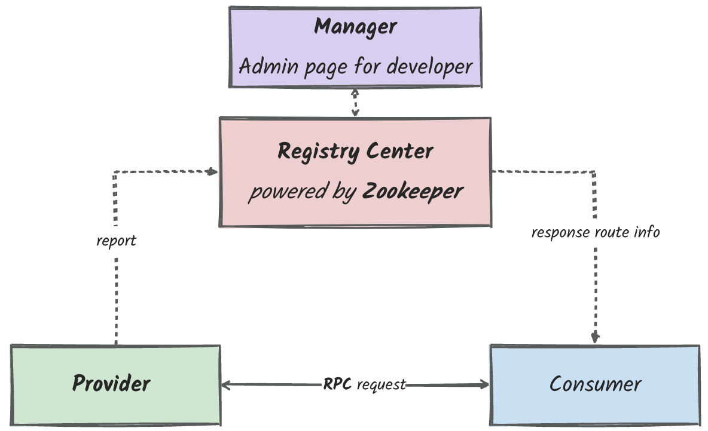

# RPC服务开发：服务注册与发现

1. 为什么需要服务注册与发现？注册中心、调用方和提供方三者之间的关系是什么
2. 服务调用方和服务提供方之间调用的契约是什么？
3. 服务订阅从注册中心哪里得到的是什么数据？
4. 基于Zookeeper的服务发现是如何实现的？
5. Watcher机制是如何实现服务更新**实时变更推送**的？
6. 服务发现的本质是什么，维护的是什么**数据之间的mapping**
7. 实现服务注册与发现功能的思路是什么？
   1. 服务平台管理端 *Manager* 是什么，职责是什么？
   2. Zookeeper集群是什么的职责是什么？
   3. 服务调用者的职责是什么？
   4. 服务提供者的职责是什么？
8. 服务平台管理端 *Manager* 创建的服务根路径是什么，有什么含义？
9. 路径下的为什么要保存服务提供方和服务调用方的列表目录？
10. 服务提供方注册的时候
    1. 创建的是什么持久化类型的节点，为什么？
    2. 存储的是什么信息？
11. 服务调用方订阅的时候
    1. 创建的是什么持久化类型的节点，为什么？
    2. 存储的是什么信息？
    3. 为什么使用Watcher机制，Watch的是什么变化？
12. 服务提供方的数据变更之后，Zookeeper会做什么？
13. Zookeeper是什么模型，会存在什么性能问题？除了Zookeeper还有什么其他厂商的开源注册中心，他们的解决方案是什么？

## 1. 整体架构和Maven代码结构

### 1.1 运行时的整体架构和组件

运行时，整体架构如下，包含Registry Center、consumer、provider三个组件


1. Registry Center负责管理服务和提供者之间的映射关系，关注服务Provider的上下线，并对请求路由关系的Consumer做出响应
2. Provider负责启动后将自己的服务和提供者的信息上报给Registry Center
3. Consumer负责向Registry Center发送路由关系请求，并按照返回的路由关系向服务Provider发起真正的请求。


我们还需要需要一个类似RocketMQ或者dubbo admin之类的管理页面，这个模块命名为manager



### 1.2 Maven代码结构

总的工程结构如下：


Lite-rpc 的作用主要是起到dependencyManagement的作用，管理整个项目的依赖包版本，并引入一些常用的基础工具类（*比如apache commons、lombok等*）

项目构建出来的module如下所示：


暂时都用quickstart的maven archetype先创建出来，确定好依赖关系之后，后续内部的代码可以慢慢补充

#### 1.2.1 Framework 工程

下面主要分为两个大module，其中framework为框架主要的module，core工程负责实现rpc框架的核心功能，manager工程包含管理页面功能实现，common存放常见的工具类、枚举、异常定义（*前期的zookeeper等网络通信服务暂存在这里，后期可以迁移到一个命名为remoting的模块里面去*）。

#### 


#### 1.2. 2 Demo 工程


demo主要存放示例工程，包含api、consumer和provider，先说Consumer和Provider，这两个就是模拟分布式系统当中服务的提供方和消费方，这里不多赘述，api其实就是provider堆外暴露的client包，包含远程调用服务的接口定义，这个接口可以内consumer持有并发起调用。


## 2. 发起调用需要做什么

### 2.1 Consumer需要做什么工作

不妨先参照dubbo的QuickStart，先绘制出来一个Consumer调用Provider的的sample，可以根据他们启动时候需要的配置和流程进行一点点完善。

首先假设我们Consumer想要调用Provider提供的IHelloLiteRpc接口的sayHi服务。


参考dubbo的QuickStart，我们的Bootstrap应该是如下所示：

```java
public class ConsumerApplication {
    public static void main(String[] args) {
        ProxyReference<IHelloLiteRpc> reference = new ProxyReference<>();
        reference.setInterfaceClass(IHelloLiteRpc.class);

        RpcBootstrap.getInstance()
                .appName("demo-consumer")
                .registry(new ZookeeperRegistryCenter("127.0.0.1:2181,127.0.0.1:2182,127.0.0.1:2183", 10000))
                .reference(reference);

        IHelloLiteRpc helloLiteRpc = reference.get();
        helloLiteRpc.sayHi("\"This is Consumer\"");
    }
}
```

两个核心的点：

1. ProxyReference会帮助创建代理对象，这个代理对象会帮助本机发起rpc请求获取来自provider的调用结果。
2. Bootstrap这个类是指定要和哪一个注册中心发起请求，因为要先通过RegistryCenter获取provider的通信地址之后才能进行Consumer调用Provider的操作。


### 2.2 Provider需要做什么工作

在Consumer能够从RegistryCenter那边获取到指定服务的Provider的ip:port之前，Provider需要将自己提供的服务的全限定名和ip地址提交并注册到RegistryCenter里面去。

除了指定RegistryCenter之外，还需要指定类似使用的protocol、serialize方式，这些都作为信息提供给Bootstrap，Bootstrap在启动的时候会在主线程读取这些配置并启动Provider机器等待请求进来。

```java
public class ProviderApplication {
    public static void main(String[] args) {
        ServiceConfig serviceConfig = ServiceConfig.builder()
                .serviceInterface(IHelloLiteRpc.class)
                .serviceInstance(new HelloLiteRpcServiceImpl())
                .build();
        
        RpcBootstrap.getInstance()
                .appName("demo-provider")
                .registry(new RegistryCenterFactory()
                        .setConnectString("zookeeper://127.0.0.1:2181,127.0.0.1:2182,127.0.0.1:2183")
                        .setSessionTimeout(10000)
                        .getRegistryCenter())
                .protocol(new ProtocolConfig("jdk"))
                .serialize(new SerializationConfig("jdk"))
                .publish(serviceConfig)
                .start();

    }
}
```

要点如下：

1. appName标志这个服务是来自那个应用提供的
2. registry这里做的扩展性好一点，做了一个简单工厂模式，根据zookeeper://127.0.0.1:2181,127.0.0.1:2182,127.0.0.1:2183这种链接url的前缀来匹配对于的RegistryCenter实现，RegistryCenter的子类实现提供不同分布式注册中心的实现支持的注册功能（包括zookeeper、etcd、nacos...）。*参考A附录：A.1 RegistryCenterFactory*
3. ServiceConfig包含的是想要提供服务的接口信息，包含接口的类型和实际提供服务的serviceImpl。
4. publish方法内部对服务进行注册，RegistryCenterFactory的产品类就是RegistryCenter、子类实现包含ZookeeperRegistryCenter之类的实现，ZookeeperRegistryCenter会提供由Zookeeper驱动的服务信息暂存服务。
5. ZookeeperRegistryCenter内部持有Zookeeper Client，RegistryCenter#register(ServiceConfig serviceConfig)注册的过程其实就是创建服务的节点、并将服务提供者的ip存储在这个节点下面的列表里面。

### 2.3 Provider的服务注册和Zookeeper的存储结构

在RpcBootstrap#publish会对消费者的服务在zookeeper上进行注册，内部方法是委托持有的RegistryCenter接口的实现来完成服务的注册

```java
public RpcBootstrap publish(ServiceConfig serviceConfig) {
    //check RpcBootstrap's attributes null
    registryCenter.register(serviceConfig);
    return this;
}
```

在上面代码当中，RegistryCenter接口实际上是子类ZookeeperRegistryCenter，类的实现关系如下：


ZookeeperRegistryCenter内部的ZookeeperRegistryCenter#register(ServiceConfig serviceConfig) 完成的服务注册动作，先不看代码实现，先设计因该如何存储整个框架当中Consumer和Provider的机器信息和服务信息因该如何存储？

我们设计如下：

```
lite-rpc-metadata
	└ providers
		└ org.example.rpc.demo.IService1
			└ node1 [...]
			├ node2	[...]
			└	node3	[...]
  └ consumers
		└ org.example.rpc.demo.IService1
			└ node1 [...]
			├ node2	[...]
			└	node3	[...]
  └ ....
```

首先顶层的/lite-rpc-metadata、/lite-rpc-metadata/providers和/lite-rpc-metadata/consumer都由初始化程序来实现完成一次性的持久节点创建 *比如可以让manager工程的来实现*。

/lite-rpc-metadata/providers/org.example.rpc.demo.IService1节点也是持久化节点，这个节点由发布这个服务的Provider在注册的时候创建，“node1 [...]”这个节点就是临时节点，key就是IPAddress:Port的一个组合，node2、3都类似。

Provider设计成临时节点这样做的好处就是，可以对这个临时节点的下线进行添加监视Watcher机制，一来Watcher机制的消息送达告知RegistryCenter来维护服务映射关系，告知到Consumer。

回到代码实现如下。

```java
@Slf4j
public class ZookeeperRegistryCenter extends AbstractRegistryCenter {
    private static final int PORT_8088 = 8088;
    private final ZookeeperClient zookeeperClient;
    public ZookeeperRegistryCenter(String connectionString, int sessionTimeout) {
        this.zookeeperClient = new ZookeeperClusterClient(connectionString, sessionTimeout, null);
    }
    @Override
    public void register(ServiceConfig serviceConfig) {
        if (log.isDebugEnabled()) {
            log.debug("... {}", serviceConfig);
        }

        String serviceNodePath = getProviderServicePath(serviceConfig.getServiceInterface().getName());
        ZNode serviceNode = ZNode.createEmpty(serviceNodePath);
        //check service node exists before create
        zookeeperClient.createPersistentNodeNx(serviceNode);

        //create Ephemeral node, ip ( The ip address of the LAN ) :port
        String thisProviderNodePath = getProviderServiceNodePath(serviceConfig.getServiceInterface().getName(), NetworkUtils.getIpAddress(), PORT_8088);
        ZNode serviceProviderNode = ZNode.createEmpty(thisProviderNodePath);
        zookeeperClient.createEphemeralNodeNx(serviceProviderNode);
    }
    @Override
    public void close() {
        zookeeperClient.close();
    }
}
```

要点：

1. 先调用zookeeperClient.createPersistentNodeNx创建服务节点，key是接口的全限定名称，完成之后是/lite-rpc-metadata/providers/org.example.rpc.demo.IService1这样的。
2. 再调用zookeeperClient.createEphemeralNodeNx创建服务Provider的通信地址临时节点，NetworkUtils.getIpAddress()会解析出当前服务提供者的LAN局域网IP地址。
3. 最后别忘记close connection，释放资源。

其中ZookeeperClient & ZookeeperClusterClient和NetworkUtils代码都会展示在A附录下。


## A. 附录

### A.1 RegistryCenterFactory

位于lite-rpc-core内

```JAVA
@Data
@Slf4j
@Accessors(chain = true)
public class RegistryCenterFactory {

    @Getter
    private String connectString;

    private int sessionTimeout;

    public RegistryCenter getRegistryCenter() {
        String[] split = getConnectString().split("://");
        if (split.length != 2) {
            throw new IllegalArgumentException("connectString must be like: xxx://xxx");
        }
        String typePrefix = split[0];
        String realConnectString = split[1];
        if (log.isDebugEnabled()) {
            log.debug("RegistryCenterFactory getRegistryCenter, typePrefix:{}, realConnectString:{}", typePrefix, realConnectString);
        }
        switch (typePrefix) {
            case "zookeeper":
                return new ZookeeperRegistryCenter(realConnectString, getSessionTimeout());
            case "etcd":
            default:
                throw new RegistryCenterNotFoundException("not found registry center type:" + typePrefix);
        }
    }
}
```


### A.2 ZookeeperClient & ZookeeperClusterClient

位于lite-rpc-common module内部

```java
public interface ZookeeperClient {

    void createPersistentNodeNx(ZNode node) throws ZookeeperException;

    /**
     * create a persistent node if not exist, else print a message
     *
     * @param node znode
     * @throws ZookeeperException zookeeper exception
     */
    void createPersistentNodeNx(ZNode node, Watcher watcher) throws ZookeeperException;


    void createEphemeralNodeNx(ZNode node) throws ZookeeperException;

    /**
     * create an ephemeral node if not exist, else print a message
     */
    void createEphemeralNodeNx(ZNode node, Watcher watcher) throws ZookeeperException;


    Boolean checkNodeExists(ZNode node) throws ZookeeperException;

    /**
     * check if node exists
     */
    Boolean checkNodeExists(ZNode node, Watcher watcher) throws ZookeeperException;

    /**
     * close zookeeper client
     */
    void close();
}
```

```java
/**
 * zookeeper cluster service
 *
 * @author yelihu
 */
@Slf4j
@Getter
public class ZookeeperClusterClient implements ZookeeperClient {
    @ForTestingOnly
    public static final String TEST_LOCAL_ZOOKEEPER_CLUSTER_CONNECT_URL = "127.0.0.1:2181,127.0.0.1:2182,127.0.0.1:2183";

    private static final int SESSION_TIMEOUT = 10000;

    private final String connectUrl;

    private final int timeout;

    private final Watcher watcher;

    private final ZooKeeper zooKeeper;

    public ZookeeperClusterClient(String url, int timeout, Watcher watcher) {
        ZooKeeper zookeeper = this.getClient(url, timeout, watcher);
        this.connectUrl = url;
        this.timeout = timeout;
        this.watcher = watcher;
        this.zooKeeper = zookeeper;
    }

    public ZookeeperClusterClient(Watcher watcher) {
        ZooKeeper zookeeper = this.getClient(TEST_LOCAL_ZOOKEEPER_CLUSTER_CONNECT_URL, SESSION_TIMEOUT, watcher);
        if (Objects.isNull(zookeeper)) {
            throw new ZookeeperException("zookeeper client init error");
        }
        this.connectUrl = TEST_LOCAL_ZOOKEEPER_CLUSTER_CONNECT_URL;
        this.timeout = SESSION_TIMEOUT;
        this.watcher = watcher;
        this.zooKeeper = zookeeper;
    }

    public ZooKeeper getClient(String connectUrl, int timeout, Watcher watcher) {
        ZooKeeper zooKeeper;
        try {
            zooKeeper = new ZooKeeper(connectUrl, timeout, watcher);
        } catch (IOException e) {
            log.error("connection with zookeeper occurs IOException, message={}", e.getMessage());
            throw new ZookeeperException(e.getMessage(), e);
        }
        return zooKeeper;
    }

    @Override
    public void createPersistentNodeNx(ZNode node) throws ZookeeperException {
        createPersistentNodeNx(node, null);
    }

    @Override
    public void createPersistentNodeNx(ZNode node, Watcher watcher) {
        CreateMode createMode = CreateMode.PERSISTENT;
        createNodeNx(node, watcher, createMode);
    }

    @Override
    public void createEphemeralNodeNx(ZNode node) throws ZookeeperException {
        createEphemeralNodeNx(node, null);
    }

    @Override
    public void createEphemeralNodeNx(ZNode node, Watcher watcher) {
        CreateMode createMode = CreateMode.EPHEMERAL;
        createNodeNx(node, watcher, createMode);
    }

    @Override
    public Boolean checkNodeExists(ZNode node) throws ZookeeperException {
        return checkNodeExists(node, null);
    }

    private void createNodeNx(ZNode node, Watcher watcher, CreateMode persistent) {
        try {
            String createResult;
            //create node if not exists
            if (!this.checkNodeExists(node, watcher)) {
                createResult = zooKeeper.create(node.getPath(), node.getData(), OPEN_ACL_UNSAFE, persistent);
                log.info("zookeeper znode created, path={}, result={}", node.getPath(), createResult);
            } else {
                if (log.isDebugEnabled()) {
                    log.debug("zookeeper znode={} already exists", node.getPath());
                }
            }
        } catch (KeeperException | InterruptedException e) {
            log.error("check znode exists or create node error, message={}", e.getMessage());
            throw new ZookeeperException(e.getMessage(), e);
        }
    }

    @Override
    public Boolean checkNodeExists(ZNode node, Watcher watcher) {
        try {
            Stat exists = zooKeeper.exists(node.getPath(), watcher);
            return exists != null;
        } catch (KeeperException | InterruptedException e) {
            log.error("check znode exists error, message={}", e.getMessage());
            throw new ZookeeperException(e.getMessage(), e);
        }
    }

    @Override
    public void close() {
        try {
            zooKeeper.close();
        } catch (InterruptedException e) {
            log.error("close zookeeper client error, message={}", e.getMessage());
            throw new ZookeeperException(e.getMessage(), e);
        }
    }

}
```

```java
@Getter
public class ZNode {

    private String path;

    private byte[] data;


    private ZNode(String path, byte[] data) {
        this.path = path;
        this.data = data;
    }

    public static ZNode create(String path, byte[] data) {
        return new ZNode(path, data);
    }

    public static ZNode createEmpty(String path) {
        return new ZNode(path, null);
    }
}
```


### A.3 NetworkUtils

位于lite-rpc-common内

```java
@Slf4j
public class NetworkUtils {
    /**
     * get LAN ip address
     *
     * @return {@link String}
     */
    public static String getIpAddress() {
        try {
            Enumeration<NetworkInterface> interfaces = NetworkInterface.getNetworkInterfaces();
            while (interfaces.hasMoreElements()) {
                NetworkInterface anInterface = interfaces.nextElement();
                //filter loopback and virtual network interface
                if (anInterface.isLoopback() || anInterface.isVirtual() || !anInterface.isUp()) {
                    continue;
                }
                Enumeration<InetAddress> addresses = anInterface.getInetAddresses();
                while (addresses.hasMoreElements()) {
                    InetAddress addr = addresses.nextElement();
                    //filter ipv6 and loopback address
                    if (addr instanceof Inet6Address || addr.isLoopbackAddress()) {
                        continue;
                    }
                    String ipResult = addr.getHostAddress();
                    if (log.isDebugEnabled()) {
                        log.debug("NetUtils getIpAddress ipResult: " + ipResult);
                    }
                    return ipResult;
                }
            }
            throw new NetworkException("can not get ip address");
        } catch (SocketException e) {
            log.error("NetUtils getIpAddress error={}", e.getMessage());
            throw new NetworkException(e.getMessage(), e);
        }
    }
}
```


### A.4 RpcBootstrap

位于lite-rpc-core module内

```java
package org.example.rpc;


import lombok.Getter;
import lombok.NoArgsConstructor;
import lombok.extern.slf4j.Slf4j;
import org.apache.commons.lang3.ObjectUtils;
import org.example.rpc.registry.RegistryCenter;

import java.util.List;

import static lombok.AccessLevel.PRIVATE;


/**
 * provider bootstrap, which is used to initialize the provider service
 *
 * @author yelihu
 */
@Getter
@Slf4j
@NoArgsConstructor(access = PRIVATE)
public class RpcBootstrap {

    /**
     * singleton instance
     */
    private static final RpcBootstrap singletonInstance = new RpcBootstrap();

    /**
     * application name, identify this application
     */
    private String appName;

    /**
     * serialization configuration
     */
    private SerializationConfig serialize;

    /**
     * protocol configuration
     */
    private ProtocolConfig protocol;

    /**
     * registry center configuration, configure the registry center address and port
     */
    private RegistryCenter registryCenter;


    public static RpcBootstrap getInstance() {
        return singletonInstance;
    }

    public RpcBootstrap appName(String appName) {
        this.appName = appName;
        return this;
    }

    public RpcBootstrap registry(RegistryCenter registryCenter) {
        if (log.isDebugEnabled()) {
            log.debug("registry center config, use registry center {}", registryCenter.getClass().getSimpleName());
        }
        this.registryCenter = registryCenter;
        return this;
    }

    public RpcBootstrap serialize(SerializationConfig serialize) {
        this.serialize = serialize;
        return this;
    }

    public RpcBootstrap protocol(ProtocolConfig protocol) {
        if (log.isDebugEnabled()) {
            log.debug("protocol config, use protocol {}", protocol);
        }
        this.protocol = protocol;
        return this;
    }

    /**
     * configure the service reference, create proxy object when {@link ProxyReference#get()} is called
     *
     * @param reference service reference
     * @return {@link RpcBootstrap}
     */
    public RpcBootstrap reference(ProxyReference<?> reference) {

        return this;
    }

    /**
     * publish the service to the registry center
     *
     * @param serviceConfig Service configuration
     * @return {@link RpcBootstrap}
     */
    public RpcBootstrap publish(ServiceConfig serviceConfig) {
        //check RpcBootstrap's attributes null
        if (ObjectUtils.anyNull(this.appName, this.registryCenter, this.serialize, this.protocol, serviceConfig)) {
            throw new IllegalArgumentException("RpcBootstrap's attributes can not be null,check configuration before publish");
        }
        registryCenter.register(serviceConfig);
        return this;
    }


    public RpcBootstrap publish(List<ServiceConfig> serviceConfig) {
        serviceConfig.forEach(this::publish);
        return this;
    }


    /**
     * start this bootstrap
     */
    public void start() {
        try {
            Thread.sleep(30000);
        } catch (InterruptedException e) {
            throw new RuntimeException(e);
        } finally {
            try {
                registryCenter.close();
            } catch (Exception e) {
                throw new RuntimeException(e);
            }
        }
    }


}
```

